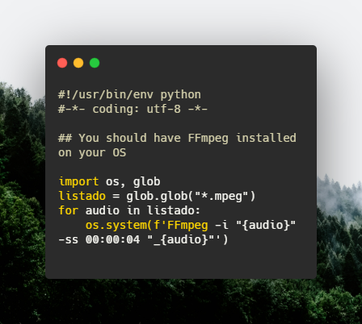
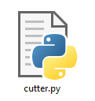

# Sound Files cutter

The simplest "first-four-seconds-deleter" for MPEG Files.

## Usage
- Install [Python 3](https://www.python.org/downloads/).
- Install FFmpeg.
- Put all you *.mpeg files next to the **cutter.py** file.
- Run **cutter.py**

- Finally you have all your sound files without the first 4 seconds each one.

## Resources
- Photo by [Adrien Olichon](https://unsplash.com/@adrienolichon) on Unsplash
- Source Code Image by [Carbon](https://carbon.now.sh/)